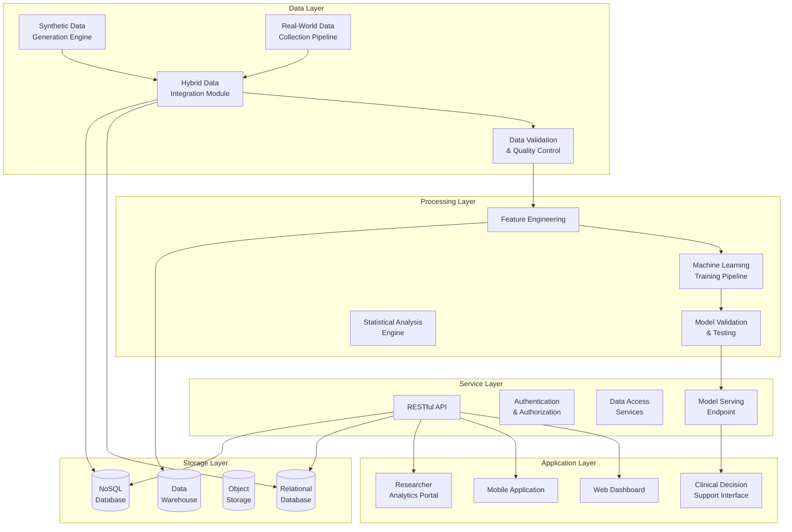

# **Software Requirements Specification (SRS) - Comprehensive Version**
## **Integrated Nano-Theranostic Platform for Esophageal Cancer Management (INEsCape)**
**Version: 4.0 - Full English with Synthetic & Real Data Support**
**Date: 2024-05-19**

---

## **Table of Contents**
1. [Introduction](#1-introduction)
2. [Overall Description](#2-overall-description)
3. [Functional Requirements](#3-functional-requirements)
4. [Non-Functional Requirements](#4-non-functional-requirements)
5. [Data Management: Synthetic & Real Data](#5-data-management-synthetic--real-data)
6. [System Architecture](#6-system-architecture)
7. [Implementation & Deployment](#7-implementation--deployment)
8. [Security & Ethical Considerations](#8-security--ethical-considerations)
9. [Appendices](#9-appendices)

---

## **1. Introduction**

### **1.1 Purpose**
This document specifies the comprehensive software requirements for **INEsCape** (Integrated Nano-Theranostic Platform for Esophageal Cancer Management). The system integrates synthetic and real-world data to accelerate nanotechnology-based cancer research and clinical decision support.

### **1.2 Scope**
INEsCape covers the complete data lifecycle for esophageal cancer research:
- Synthetic data generation for model development
- Real-world data collection from public repositories
- Hybrid data integration and validation
- Machine learning model training and deployment
- Clinical decision support systems

### **1.3 Definitions and Acronyms**

| Term | Definition |
|------|------------|
| Nanosystem | Engineered nanostructures for diagnostic or therapeutic purposes |
| Theranostic | Combined diagnostic and therapeutic system |
| Adenocarcinoma | Most common type of esophageal cancer |
| Synthetic Data | Artificially generated data that mimics real-world statistical properties |
| Real-World Data (RWD) | Data collected from actual patients, clinical trials, and research studies |
| ETL | Extract, Transform, Load process |
| HIPAA | Health Insurance Portability and Accountability Act |
| GDPR | General Data Protection Regulation |

### **1.4 References**
- IEEE 830-1998: Recommended Practice for Software Requirements Specifications
- FDA Guidelines for Real-World Evidence
- HIPAA Security Rule (45 CFR Part 160 and Subparts A and C of Part 164)
- GDPR Article 9: Processing of Special Categories of Personal Data

---

## **2. Overall Description**

### **2.1 Product Perspective**
INEsCape is an independent, cloud-based platform that interfaces with:
- Public data repositories (TCGA, GEO, Kaggle)
- Hospital information systems (via secure APIs)
- Research laboratory equipment
- Clinical trial management systems

### **2.2 User Classes and Characteristics**

| User Class | Primary Responsibilities | Data Access Level |
|------------|--------------------------|-------------------|
| **Data Scientist** | ML model development, data analysis | Full synthetic + anonymized real data |
| **Clinical Researcher** | Clinical trial design, data interpretation | Anonymized patient data + synthetic |
| **Medical Oncologist** | Patient treatment planning | De-identified patient data + recommendations |
| **Data Engineer** | Data pipeline management, ETL processes | All data types with security controls |
| **System Administrator** | Platform maintenance, user management | System logs, metadata, no patient data |
| **Ethics Committee** | Compliance monitoring, audit trails | Anonymized access logs, data usage reports |

### **2.3 Operating Environment**
- **Cloud Infrastructure**: AWS/GCP/Azure with Kubernetes orchestration
- **Operating Systems**: Linux containers (Ubuntu 20.04+)
- **Database Systems**: PostgreSQL 14+, MongoDB 6+, Redis 7+
- **Data Storage**: MinIO/S3 compatible object storage
- **Networking**: HTTPS/TLS 1.3, VPN for sensitive data transfer

### **2.4 Design and Implementation Constraints**
1. All patient data must be de-identified before storage
2. Maximum data latency: < 5 seconds for synthetic data queries
3. Support for multi-modal data (images, genomics, clinical)
4. Compliance with international data protection regulations

### **2.5 Assumptions and Dependencies**
- Availability of public cancer data repositories
- Adequate computational resources for ML training
- Clinical partner cooperation for real-world data validation
- Continued development of nanotechnology research protocols

---

## **3. Functional Requirements**

### **3.1 Synthetic Data Generation Module**

| ID | Requirement | Priority | Acceptance Criteria |
|----|-------------|----------|---------------------|
| **FR1.1** | Generate synthetic patient demographic data with realistic distributions | High | Data passes Kolmogorov-Smirnov test against real distributions (p > 0.05) |
| **FR1.2** | Create synthetic clinical profiles for esophageal cancer subtypes | High | ≥95% statistical similarity to TCGA-ESCA clinical data |
| **FR1.3** | Simulate tumor progression timelines based on cancer stage and grade | High | Progression rates within ±10% of SEER database statistics |
| **FR1.4** | Generate synthetic genomic data with realistic mutation frequencies | Medium | Mutation rates match COSMIC database for esophageal cancer |
| **FR1.5** | Create synthetic medical images (endoscopy, CT, PET-CT) | Medium | Images pass radiologist review for realistic features |
| **FR1.6** | Simulate treatment responses based on molecular profiles | High | Response rates within clinical trial confidence intervals |
| **FR1.7** | Generate longitudinal data with realistic temporal patterns | Medium | Time-series data shows realistic progression patterns |
| **FR1.8** | Create synthetic control groups with matched characteristics | High | Control groups pass balance tests (SMD < 0.1) |

### **3.2 Real-World Data Collection Module**

| ID | Requirement | Priority | Acceptance Criteria |
|----|-------------|----------|---------------------|
| **FR2.1** | Automated discovery of relevant datasets from public repositories | High | Identifies ≥90% of known esophageal cancer datasets |
| **FR2.2** | Secure API integration with TCGA, GEO, and other data portals | High | Successful data retrieval rate ≥95% |
| **FR2.3** | Real-time monitoring of new dataset releases | Medium | Notification within 24 hours of new data publication |
| **FR2.4** | Data quality assessment and validation | High | Quality metrics calculated for all imported datasets |
| **FR2.5** | Automated de-identification of patient data | Critical | No identifiable information remains after processing |
| **FR2.6** | Metadata extraction and cataloging | Medium | Complete metadata for ≥95% of collected datasets |
| **FR2.7** | Data transformation to unified format | High | All data converted to standard schema |
| **FR2.8** | Version control for dataset updates | Medium | Full version history maintained for all datasets |

### **3.3 Hybrid Data Integration Module**

| ID | Requirement | Priority | Acceptance Criteria |
|----|-------------|----------|---------------------|
| **FR3.1** | Statistical matching between synthetic and real data | High | Correlation coefficients ≥0.8 for key variables |
| **FR3.2** | Data fusion algorithms for combining data sources | High | Combined datasets maintain statistical properties |
| **FR3.3** | Quality metrics for hybrid datasets | High | Quality scores calculated and reported |
| **FR3.4** | Bias detection and correction | Medium | Bias metrics below predefined thresholds |
| **FR3.5** | Cross-validation between synthetic and real data | High | Validation scores reported for all models |
| **FR3.6** | Data augmentation using synthetic samples | Medium | Augmentation improves model performance by ≥5% |
| **FR3.7** | Privacy-preserving data synthesis | Critical | No data leakage between real and synthetic sets |

### **3.4 Machine Learning & Analysis Module**

| ID | Requirement | Priority | Acceptance Criteria |
|----|-------------|----------|---------------------|
| **FR4.1** | Automated feature engineering from multi-modal data | High | Feature extraction time < 30 minutes per dataset |
| **FR4.2** | Model training with synthetic data | High | Model convergence within specified iterations |
| **FR4.3** | Transfer learning from synthetic to real data | Medium | Performance drop < 10% when transferring |
| **FR4.4** | Explainable AI for model predictions | High | Feature importance scores provided for all predictions |
| **FR4.5** | Performance comparison between synthetic and real data | High | Comparative metrics with confidence intervals |
| **FR4.6** | Automated hyperparameter optimization | Medium | Optimization improves performance by ≥3% |
| **FR4.7** | Model validation on hold-out real data | Critical | All models validated before deployment |

### **3.5 Clinical Decision Support Module**

| ID | Requirement | Priority | Acceptance Criteria |
|----|-------------|----------|---------------------|
| **FR5.1** | Risk prediction for esophageal cancer development | High | AUC ≥ 0.85 on validation data |
| **FR5.2** | Treatment recommendation engine | High | Recommendations align with NCCN guidelines |
| **FR5.3** | Prognostic scoring system | Medium | Scores correlate with actual outcomes (r ≥ 0.7) |
| **FR5.4** | Personalized nanosystem design suggestions | High | Suggestions validated by domain experts |
| **FR5.5** | Clinical trial matching | Medium | Match accuracy ≥ 90% |
| **FR5.6** | Real-time monitoring alerts | High | Alert generation within 5 seconds of trigger |

### **3.6 Data Management & Security Module**

| ID | Requirement | Priority | Acceptance Criteria |
|----|-------------|----------|---------------------|
| **FR6.1** | Role-based access control (RBAC) | Critical | Access violations < 0.1% |
| **FR6.2** | Complete audit trail | Critical | 100% of data accesses logged |
| **FR6.3** | Data encryption at rest and in transit | Critical | AES-256 encryption for all sensitive data |
| **FR6.4** | Automated backup and recovery | High | RTO < 4 hours, RPO < 15 minutes |
| **FR6.5** | Data versioning and lineage tracking | Medium | Complete lineage for all derived datasets |
| **FR6.6** | Data retention policies | Medium | Automatic data archiving per policy |

---

## **4. Non-Functional Requirements**

### **4.1 Performance Requirements**

| Metric | Requirement | Measurement Method |
|--------|-------------|-------------------|
| **Response Time** | < 2 seconds for 95% of queries | Load testing with simulated users |
| **Throughput** | Support 100 concurrent users | Stress testing |
| **Data Processing** | Process 1TB of data within 24 hours | Benchmark testing |
| **Model Training** | Train basic models within 1 hour | Performance monitoring |
| **Data Generation** | Generate 10,000 synthetic samples in < 5 minutes | Synthetic data pipeline testing |

### **4.2 Security Requirements**

| Requirement | Description | Verification Method |
|-------------|-------------|-------------------|
| **Authentication** | Multi-factor authentication for all users | Security audit |
| **Authorization** | Fine-grained access control | Access control testing |
| **Data Encryption** | End-to-end encryption | Cryptographic validation |
| **Audit Logging** | Immutable audit trails | Log analysis |
| **Vulnerability Management** | Regular security scanning | Penetration testing |

### **4.3 Reliability Requirements**
- System availability: 99.9% uptime
- Mean time between failures (MTBF): > 720 hours
- Mean time to repair (MTTR): < 1 hour
- Data integrity: Zero data corruption incidents

### **4.4 Usability Requirements**
- User training time: < 4 hours for basic operations
- User satisfaction score: > 4.5/5 on System Usability Scale
- Accessibility: WCAG 2.1 AA compliance
- Error rate: < 5% for trained users

### **4.5 Scalability Requirements**
- Horizontal scaling to 1000+ concurrent users
- Data storage scaling to 100+ TB
- Computational scaling for large ML models
- Geographic distribution across multiple regions

### **4.6 Maintainability Requirements**
- Code coverage: > 80% unit test coverage
- Documentation: Complete API documentation
- Deployment: Automated CI/CD pipelines
- Monitoring: Comprehensive observability stack

---

## **5. Data Management: Synthetic & Real Data**

### **5.1 Comprehensive Synthetic Data Generation Script**

```python
"""
Comprehensive Synthetic Data Generator for Esophageal Cancer Research
Version: 2.0
Generates 1000 synthetic samples: 300 cancer patients, 700 normal controls
"""

import numpy as np
import pandas as pd
from datetime import datetime, timedelta
import random
from scipy import stats
from typing import Dict, List, Tuple
import json
import os

class EsophagealCancerSyntheticData:
    """
    Advanced synthetic data generator for esophageal cancer research
    Generates realistic multi-modal data including clinical, genomic, and imaging features
    """
    
    def __init__(self, seed=42):
        self.seed = seed
        np.random.seed(seed)
        random.seed(seed)
        
        # Cancer type distributions based on real-world epidemiology
        self.cancer_types = {
            'adenocarcinoma': {
                'prevalence': 0.85,
                'median_age': 67,
                'male_ratio': 0.75,
                'smoking_associated': 0.65,
                'obesity_associated': 0.80,
                'subtypes': ['intestinal', 'diffuse', 'mucinous']
            },
            'squamous_cell_carcinoma': {
                'prevalence': 0.12,
                'median_age': 70,
                'male_ratio': 0.80,
                'smoking_associated': 0.85,
                'alcohol_associated': 0.70,
                'subtypes': ['keratinizing', 'non-keratinizing', 'basaloid']
            },
            'neuroendocrine_carcinoma': {
                'prevalence': 0.02,
                'median_age': 55,
                'male_ratio': 0.60,
                'subtypes': ['small_cell', 'large_cell']
            },
            'gastrointestinal_stromal_tumor': {
                'prevalence': 0.01,
                'median_age': 60,
                'male_ratio': 0.55,
                'subtypes': ['spindle_cell', 'epithelioid', 'mixed']
            }
        }
        
        # Clinical parameters based on literature
        self.clinical_parameters = {
            'symptoms': {
                'dysphagia': {'cancer': 0.85, 'normal': 0.02},
                'weight_loss': {'cancer': 0.75, 'normal': 0.01},
                'chest_pain': {'cancer': 0.50, 'normal': 0.05},
                'heartburn': {'cancer': 0.40, 'normal': 0.15},
                'regurgitation': {'cancer': 0.30, 'normal': 0.10}
            },
            'risk_factors': {
                'smoking': {'cancer': 0.70, 'normal': 0.25},
                'alcohol': {'cancer': 0.60, 'normal': 0.20},
                'obesity': {'cancer': 0.65, 'normal': 0.30},
                'gerd': {'cancer': 0.80, 'normal': 0.10},
                'barretts_esophagus': {'cancer': 0.40, 'normal': 0.01}
            }
        }
        
        # Genomic mutation frequencies from COSMIC database
        self.genomic_mutations = {
            'adenocarcinoma': {
                'TP53': 0.75,
                'CDKN2A': 0.40,
                'SMAD4': 0.30,
                'ARID1A': 0.25,
                'ERBB2': 0.20,
                'PIK3CA': 0.15
            },
            'squamous_cell_carcinoma': {
                'TP53': 0.90,
                'CDKN2A': 0.50,
                'NOTCH1': 0.30,
                'PIK3CA': 0.25,
                'FBXW7': 0.20
            }
        }
        
        # Biomarker ranges
        self.biomarkers = {
            'cea': {'normal': (0, 3), 'cancer': (5, 100)},
            'ca19_9': {'normal': (0, 37), 'cancer': (40, 500)},
            'crp': {'normal': (0, 5), 'cancer': (10, 100)},
            'albumin': {'normal': (3.5, 5.0), 'cancer': (2.5, 4.0)}
        }
    
    def generate_patient_demographics(self, n_patients=1000, cancer_ratio=0.3):
        """
        Generate synthetic patient demographics
        """
        patients = []
        
        n_cancer = int(n_patients * cancer_ratio)
        n_normal = n_patients - n_cancer
        
        # Generate cancer patients
        for i in range(n_cancer):
            # Determine cancer type based on prevalence
            cancer_type = np.random.choice(
                list(self.cancer_types.keys()),
                p=[t['prevalence'] for t in self.cancer_types.values()]
            )
            
            cancer_info = self.cancer_types[cancer_type]
            
            # Generate age based on cancer type
            age = int(np.random.normal(cancer_info['median_age'], 8))
            age = max(40, min(age, 90))
            
            # Generate gender based on cancer type male ratio
            gender = 'Male' if random.random() < cancer_info['male_ratio'] else 'Female'
            
            # Generate ethnicity distribution
            ethnicity = np.random.choice(
                ['White', 'Asian', 'Black', 'Hispanic'],
                p=[0.70, 0.20, 0.05, 0.05]
            )
            
            patients.append({
                'patient_id': f'CAN{i+1:04d}',
                'age': age,
                'gender': gender,
                'ethnicity': ethnicity,
                'has_cancer': True,
                'cancer_type': cancer_type,
                'cancer_subtype': random.choice(cancer_info['subtypes'])
            })
        
        # Generate normal patients
        for i in range(n_normal):
            age = int(np.random.uniform(30, 80))
            gender = random.choice(['Male', 'Female'])
            ethnicity = np.random.choice(
                ['White', 'Asian', 'Black', 'Hispanic'],
                p=[0.70, 0.20, 0.05, 0.05]
            )
            
            patients.append({
                'patient_id': f'CTL{i+1:04d}',
                'age': age,
                'gender': gender,
                'ethnicity': ethnicity,
                'has_cancer': False,
                'cancer_type': None,
                'cancer_subtype': None
            })
        
        return pd.DataFrame(patients)
    
    def generate_clinical_data(self, patients_df):
        """
        Generate clinical symptoms and examination data
        """
        clinical_data = []
        
        for _, patient in patients_df.iterrows():
            clinical_record = {
                'patient_id': patient['patient_id'],
                'height_cm': np.random.normal(170, 10) if patient['gender'] == 'Male' else np.random.normal(160, 8),
                'weight_kg': np.random.normal(80, 15) if patient['gender'] == 'Male' else np.random.normal(65, 12),
                'systolic_bp': np.random.normal(120, 15),
                'diastolic_bp': np.random.normal(80, 10),
                'heart_rate': np.random.normal(75, 10),
                'respiratory_rate': np.random.normal(16, 3)
            }
            
            # Calculate BMI
            clinical_record['bmi'] = round(
                clinical_record['weight_kg'] / 
                ((clinical_record['height_cm'] / 100) ** 2), 1
            )
            
            # Generate symptoms based on cancer status
            symptoms = {}
            for symptom, probs in self.clinical_parameters['symptoms'].items():
                prob = probs['cancer'] if patient['has_cancer'] else probs['normal']
                symptoms[symptom] = random.random() < prob
            
            clinical_record['symptoms'] = json.dumps(symptoms)
            
            # Generate risk factors
            risk_factors = {}
            for factor, probs in self.clinical_parameters['risk_factors'].items():
                prob = probs['cancer'] if patient['has_cancer'] else probs['normal']
                risk_factors[factor] = random.random() < prob
            
            clinical_record['risk_factors'] = json.dumps(risk_factors)
            
            # Cancer-specific clinical features
            if patient['has_cancer']:
                clinical_record['tumor_location'] = random.choice([
                    'Upper esophagus', 'Middle esophagus', 'Lower esophagus', 'GE junction'
                ])
                
                clinical_record['tumor_length_cm'] = round(np.random.uniform(1.5, 8.0), 1)
                
                # Generate TNM staging
                clinical_record['t_stage'] = np.random.choice(
                    ['T1', 'T2', 'T3', 'T4'],
                    p=[0.15, 0.25, 0.40, 0.20]
                )
                clinical_record['n_stage'] = np.random.choice(
                    ['N0', 'N1', 'N2', 'N3'],
                    p=[0.30, 0.35, 0.25, 0.10]
                )
                clinical_record['m_stage'] = np.random.choice(
                    ['M0', 'M1'],
                    p=[0.70, 0.30]
                )
                
                clinical_record['histological_grade'] = np.random.choice(
                    ['Well differentiated', 'Moderately differentiated', 'Poorly differentiated'],
                    p=[0.20, 0.50, 0.30]
                )
                
                clinical_record['lymphovascular_invasion'] = random.random() < 0.40
                clinical_record['perineural_invasion'] = random.random() < 0.25
            else:
                clinical_record.update({
                    'tumor_location': None,
                    'tumor_length_cm': 0.0,
                    't_stage': None,
                    'n_stage': None,
                    'm_stage': None,
                    'histological_grade': None,
                    'lymphovascular_invasion': False,
                    'perineural_invasion': False
                })
            
            clinical_data.append(clinical_record)
        
        return pd.DataFrame(clinical_data)
    
    def generate_lab_results(self, patients_df):
        """
        Generate laboratory test results
        """
        lab_results = []
        
        # Generate multiple lab tests per patient
        test_types = ['CBC', 'Chemistry', 'Liver_Function', 'Coagulation', 'Tumor_Markers']
        
        for _, patient in patients_df.iterrows():
            for test_type in test_types:
                # Determine reference ranges based on cancer status
                is_cancer = patient['has_cancer']
                
                lab_record = {
                    'patient_id': patient['patient_id'],
                    'test_type': test_type,
                    'test_date': (
                        datetime.now() - 
                        timedelta(days=np.random.randint(1, 365))
                    ).strftime('%Y-%m-%d')
                }
                
                # Generate test-specific values
                if test_type == 'CBC':
                    if is_cancer:
                        lab_record['hemoglobin'] = round(np.random.uniform(8.0, 12.0), 1)
                        lab_record['wbc_count'] = round(np.random.uniform(4.0, 15.0), 1)
                        lab_record['platelet_count'] = round(np.random.uniform(150, 450))
                    else:
                        lab_record['hemoglobin'] = round(np.random.normal(14.0, 1.0), 1)
                        lab_record['wbc_count'] = round(np.random.normal(7.0, 2.0), 1)
                        lab_record['platelet_count'] = round(np.random.normal(250, 50))
                
                elif test_type == 'Chemistry':
                    lab_record['creatinine'] = round(np.random.normal(0.9, 0.2), 2)
                    lab_record['sodium'] = round(np.random.normal(140, 3))
                    lab_record['potassium'] = round(np.random.normal(4.0, 0.3), 1)
                
                elif test_type == 'Liver_Function':
                    if is_cancer:
                        lab_record['ast'] = round(np.random.uniform(30, 100))
                        lab_record['alt'] = round(np.random.uniform(25, 80))
                        lab_record['alkaline_phosphatase'] = round(np.random.uniform(100, 300))
                    else:
                        lab_record['ast'] = round(np.random.normal(25, 5))
                        lab_record['alt'] = round(np.random.normal(22, 4))
                        lab_record['alkaline_phosphatase'] = round(np.random.normal(70, 15))
                
                elif test_type == 'Tumor_Markers':
                    if is_cancer:
                        for marker, ranges in self.biomarkers.items():
                            lab_record[marker] = round(np.random.uniform(ranges['cancer'][0], ranges['cancer'][1]), 1)
                    else:
                        for marker, ranges in self.biomarkers.items():
                            lab_record[marker] = round(np.random.uniform(ranges['normal'][0], ranges['normal'][1]), 1)
                
                lab_results.append(lab_record)
        
        return pd.DataFrame(lab_results)
    
    def generate_genomic_data(self, patients_df):
        """
        Generate synthetic genomic and molecular data
        """
        genomic_data = []
        
        for _, patient in patients_df.iterrows():
            if not patient['has_cancer']:
                continue
            
            genomic_record = {
                'patient_id': patient['patient_id'],
                'cancer_type': patient['cancer_type'],
                'sequencing_date': (
                    datetime.now() - 
                    timedelta(days=np.random.randint(1, 180))
                ).strftime('%Y-%m-%d'),
                'sequencing_platform': np.random.choice([
                    'Illumina NovaSeq', 'Ion Torrent', 'Oxford Nanopore'
                ]),
                'coverage_depth': np.random.randint(50, 200)
            }
            
            # Generate mutations based on cancer type
            mutations = []
            mutation_info = self.genomic_mutations.get(patient['cancer_type'], {})
            
            for gene, mutation_freq in mutation_info.items():
                if random.random() < mutation_freq:
                    mutation_type = np.random.choice(
                        ['Missense', 'Nonsense', 'Frameshift', 'Splice_site'],
                        p=[0.60, 0.15, 0.20, 0.05]
                    )
                    
                    mutations.append({
                        'gene': gene,
                        'mutation_type': mutation_type,
                        'allele_frequency': round(np.random.uniform(0.1, 0.9), 3)
                    })
            
            genomic_record['mutations'] = json.dumps(mutations)
            
            # Generate copy number variations
            cnvs = []
            common_cnv_genes = ['EGFR', 'MYC', 'CCND1', 'CDK4', 'MDM2']
            for gene in common_cnv_genes:
                if random.random() < 0.3:
                    cnv_type = 'Amplification' if random.random() < 0.7 else 'Deletion'
                    cnvs.append({
                        'gene': gene,
                        'type': cnv_type,
                        'copy_number': np.random.randint(3, 10) if cnv_type == 'Amplification' else 1
                    })
            
            genomic_record['copy_number_variations'] = json.dumps(cnvs)
            
            # Generate gene expression data
            expression_data = {}
            cancer_genes = ['TP53', 'EGFR', 'HER2', 'VEGFA', 'PDL1', 'MSI_status']
            for gene in cancer_genes:
                if gene == 'MSI_status':
                    expression_data[gene] = 'MSI-H' if random.random() < 0.15 else 'MSS'
                else:
                    # Higher expression in cancer patients
                    base_exp = np.random.normal(10, 3)
                    if random.random() < 0.4:  # 40% chance of overexpression
                        base_exp *= np.random.uniform(2, 5)
                    expression_data[gene] = round(base_exp, 2)
            
            genomic_record['gene_expression'] = json.dumps(expression_data)
            
            # Generate PD-L1 status
            genomic_record['pdl1_status'] = np.random.choice(
                ['Positive', 'Negative'],
                p=[0.40, 0.60]
            )
            genomic_record['pdl1_percentage'] = round(np.random.uniform(0, 80), 1)
            
            genomic_data.append(genomic_record)
        
        return pd.DataFrame(genomic_data)
    
    def generate_imaging_data(self, patients_df):
        """
        Generate synthetic imaging data reports
        """
        imaging_data = []
        
        imaging_modalities = ['Endoscopy', 'CT_Chest_Abdomen', 'PET_CT', 'EUS', 'MRI']
        
        for _, patient in patients_df.iterrows():
            for modality in imaging_modalities:
                imaging_record = {
                    'patient_id': patient['patient_id'],
                    'imaging_modality': modality,
                    'imaging_date': (
                        datetime.now() - 
                        timedelta(days=np.random.randint(1, 180))
                    ).strftime('%Y-%m-%d'),
                    'contrast_used': random.random() < 0.7,
                    'radiologist_id': f'RAD{np.random.randint(1000, 9999)}'
                }
                
                if patient['has_cancer']:
                    # Cancer-specific findings
                    findings = []
                    
                    if modality == 'Endoscopy':
                        findings.append('Ulcerated mass with irregular borders')
                        findings.append('Friable mucosa with contact bleeding')
                        if random.random() < 0.3:
                            findings.append('Barrett\'s esophagus present')
                    
                    elif modality == 'CT_Chest_Abdomen':
                        findings.append(f"Esophageal wall thickening ({np.random.uniform(1.5, 3.0):.1f} cm)")
                        if random.random() < 0.5:
                            findings.append('Regional lymphadenopathy')
                        if random.random() < 0.2:
                            findings.append('Distant metastases noted')
                    
                    elif modality == 'PET_CT':
                        findings.append(f"Hypermetabolic lesion (SUVmax: {np.random.uniform(5.0, 15.0):.1f})")
                        if random.random() < 0.4:
                            findings.append('FDG-avid lymph nodes')
                    
                    imaging_record['findings'] = '; '.join(findings)
                    imaging_record['impression'] = 'Findings consistent with esophageal carcinoma'
                    
                    # Quantitative measurements
                    imaging_record['tumor_length_cm'] = round(np.random.uniform(2.0, 7.0), 1)
                    imaging_record['wall_thickness_cm'] = round(np.random.uniform(1.0, 2.5), 1)
                    imaging_record['lymph_nodes_positive'] = np.random.randint(0, 10)
                
                else:
                    # Normal findings
                    imaging_record['findings'] = 'No significant abnormalities'
                    imaging_record['impression'] = 'Normal study'
                    imaging_record['tumor_length_cm'] = 0.0
                    imaging_record['wall_thickness_cm'] = round(np.random.uniform(0.3, 0.5), 1)
                    imaging_record['lymph_nodes_positive'] = 0
                
                imaging_data.append(imaging_record)
        
        return pd.DataFrame(imaging_data)
    
    def generate_treatment_data(self, patients_df):
        """
        Generate synthetic treatment history and outcomes
        """
        treatment_data = []
        
        treatment_modalities = {
            'surgery': ['Esophagectomy', 'Endoscopic resection', 'Palliative stent'],
            'chemotherapy': ['Cisplatin + 5-FU', 'Carboplatin + Paclitaxel', 'FOLFOX', 'DCF'],
            'radiation': ['External beam RT', 'IMRT', 'Brachytherapy'],
            'targeted': ['Trastuzumab', 'Ramucirumab', 'Pembrolizumab', 'Nivolumab']
        }
        
        for _, patient in patients_df.iterrows():
            if not patient['has_cancer']:
                continue
            
            # Generate treatment plan
            treatments = []
            
            # Surgery (70% of cancer patients)
            if random.random() < 0.7:
                surgery = random.choice(treatment_modalities['surgery'])
                treatments.append({
                    'type': 'Surgery',
                    'regimen': surgery,
                    'cycles': 1,
                    'start_date': (
                        datetime.now() - 
                        timedelta(days=np.random.randint(30, 180))
                    ).strftime('%Y-%m-%d'),
                    'end_date': (
                        datetime.now() - 
                        timedelta(days=np.random.randint(1, 30))
                    ).strftime('%Y-%m-%d')
                })
            
            # Chemotherapy (80% of cancer patients)
            if random.random() < 0.8:
                chemo = random.choice(treatment_modalities['chemotherapy'])
                cycles = np.random.randint(4, 12)
                treatments.append({
                    'type': 'Chemotherapy',
                    'regimen': chemo,
                    'cycles': cycles,
                    'start_date': (
                        datetime.now() - 
                        timedelta(days=np.random.randint(60, 240))
                    ).strftime('%Y-%m-%d'),
                    'end_date': (
                        datetime.now() - 
                        timedelta(days=np.random.randint(1, 60))
                    ).strftime('%Y-%m-%d')
                })
            
            # Radiation (60% of cancer patients)
            if random.random() < 0.6:
                radiation = random.choice(treatment_modalities['radiation'])
                fractions = np.random.randint(25, 35)
                treatments.append({
                    'type': 'Radiation',
                    'regimen': radiation,
                    'cycles': fractions,
                    'start_date': (
                        datetime.now() - 
                        timedelta(days=np.random.randint(45, 180))
                    ).strftime('%Y-%m-%d'),
                    'end_date': (
                        datetime.now() - 
                        timedelta(days=np.random.randint(1, 45))
                    ).strftime('%Y-%m-%d')
                })
            
            # Targeted therapy (30% of cancer patients)
            if random.random() < 0.3:
                targeted = random.choice(treatment_modalities['targeted'])
                treatments.append({
                    'type': 'Targeted Therapy',
                    'regimen': targeted,
                    'cycles': np.random.randint(6, 24),
                    'start_date': (
                        datetime.now() - 
                        timedelta(days=np.random.randint(90, 360))
                    ).strftime('%Y-%m-%d'),
                    'end_date': None  # Ongoing treatment
                })
            
            # Generate treatment response
            response_options = ['Complete Response', 'Partial Response', 'Stable Disease', 'Progressive Disease']
            response_weights = [0.2, 0.4, 0.3, 0.1]
            
            treatment_record = {
                'patient_id': patient['patient_id'],
                'treatments': json.dumps(treatments),
                'best_response': np.random.choice(response_options, p=response_weights),
                'response_date': (
                    datetime.now() - 
                    timedelta(days=np.random.randint(30, 180))
                ).strftime('%Y-%m-%d'),
                'treatment_complications': random.random() < 0.3,
                'complication_details': 'Anemia, fatigue' if random.random() < 0.5 else 'Neutropenia, nausea'
            }
            
            # Generate survival data
            diagnosis_date = (
                datetime.now() - 
                timedelta(days=np.random.randint(180, 720))
            ).strftime('%Y-%m-%d')
            
            treatment_record['diagnosis_date'] = diagnosis_date
            
            # Calculate survival based on stage and response
            base_survival_days = 365 * np.random.uniform(1.0, 5.0)
            
            # Adjust based on response
            response_factor = {
                'Complete Response': 2.0,
                'Partial Response': 1.5,
                'Stable Disease': 1.0,
                'Progressive Disease': 0.5
            }[treatment_record['best_response']]
            
            survival_days = base_survival_days * response_factor
            
            treatment_record['survival_days'] = int(survival_days)
            treatment_record['vital_status'] = 'Alive' if random.random() < 0.7 else 'Deceased'
            
            if treatment_record['vital_status'] == 'Deceased':
                treatment_record['death_date'] = (
                    datetime.strptime(diagnosis_date, '%Y-%m-%d') + 
                    timedelta(days=int(survival_days))
                ).strftime('%Y-%m-%d')
                treatment_record['cause_of_death'] = 'Esophageal cancer' if random.random() < 0.8 else 'Other causes'
            else:
                treatment_record['death_date'] = None
                treatment_record['cause_of_death'] = None
            
            treatment_data.append(treatment_record)
        
        return pd.DataFrame(treatment_data)
    
    def generate_quality_of_life_data(self, patients_df):
        """
        Generate synthetic quality of life assessment data
        """
        qol_data = []
        
        qol_questionnaires = ['EORTC_QLQ_C30', 'EORTC_QLQ_OG25', 'EQ_5D', 'MDASI']
        
        for _, patient in patients_df.iterrows():
            for questionnaire in qol_questionnaires:
                # Generate multiple assessments over time
                n_assessments = np.random.randint(1, 4) if patient['has_cancer'] else 1
                
                for assessment_num in range(n_assessments):
                    assessment_date = (
                        datetime.now() - 
                        timedelta(days=np.random.randint(1, 365))
                    ).strftime('%Y-%m-%d')
                    
                    qol_record = {
                        'patient_id': patient['patient_id'],
                        'questionnaire': questionnaire,
                        'assessment_date': assessment_date,
                        'assessment_number': assessment_num + 1
                    }
                    
                    # Generate scores based on cancer status
                    if patient['has_cancer']:
                        # Lower QoL scores for cancer patients
                        qol_record['global_health_score'] = round(np.random.uniform(40, 70), 1)
                        qol_record['physical_functioning'] = round(np.random.uniform(50, 80), 1)
                        qol_record['emotional_functioning'] = round(np.random.uniform(45, 75), 1)
                        qol_record['social_functioning'] = round(np.random.uniform(40, 70), 1)
                        
                        # Symptom scores (higher = worse)
                        qol_record['fatigue_score'] = round(np.random.uniform(30, 70), 1)
                        qol_record['pain_score'] = round(np.random.uniform(20, 60), 1)
                        qol_record['dysphagia_score'] = round(np.random.uniform(25, 80), 1)
                        qol_record['reflux_score'] = round(np.random.uniform(15, 50), 1)
                    else:
                        # Higher QoL scores for normal patients
                        qol_record['global_health_score'] = round(np.random.uniform(70, 95), 1)
                        qol_record['physical_functioning'] = round(np.random.uniform(80, 100), 1)
                        qol_record['emotional_functioning'] = round(np.random.uniform(75, 95), 1)
                        qol_record['social_functioning'] = round(np.random.uniform(70, 95), 1)
                        
                        # Low symptom scores for normal patients
                        qol_record['fatigue_score'] = round(np.random.uniform(10, 30), 1)
                        qol_record['pain_score'] = round(np.random.uniform(5, 20), 1)
                        qol_record['dysphagia_score'] = round(np.random.uniform(0, 10), 1)
                        qol_record['reflux_score'] = round(np.random.uniform(5, 25), 1)
                    
                    qol_data.append(qol_record)
        
        return pd.DataFrame(qol_data)
    
    def generate_all_data(self, n_patients=1000, cancer_ratio=0.3):
        """
        Generate complete synthetic dataset
        """
        print("Generating comprehensive synthetic dataset for esophageal cancer research...")
        print(f"Total patients: {n_patients} (Cancer: {int(n_patients*cancer_ratio)}, Normal: {n_patients - int(n_patients*cancer_ratio)})")
        
        # Create output directory
        output_dir = 'synthetic_data'
        os.makedirs(output_dir, exist_ok=True)
        
        # Generate all data components
        print("\n1. Generating patient demographics...")
        patients_df = self.generate_patient_demographics(n_patients, cancer_ratio)
        
        print("2. Generating clinical data...")
        clinical_df = self.generate_clinical_data(patients_df)
        
        print("3. Generating laboratory results...")
        lab_df = self.generate_lab_results(patients_df)
        
        print("4. Generating genomic data...")
        genomic_df = self.generate_genomic_data(patients_df)
        
        print("5. Generating imaging data...")
        imaging_df = self.generate_imaging_data(patients_df)
        
        print("6. Generating treatment data...")
        treatment_df = self.generate_treatment_data(patients_df)
        
        print("7. Generating quality of life data...")
        qol_df = self.generate_quality_of_life_data(patients_df)
        
        # Save all dataframes to CSV
        print("\nSaving data to files...")
        patients_df.to_csv(f'{output_dir}/patients.csv', index=False)
        clinical_df.to_csv(f'{output_dir}/clinical_data.csv', index=False)
        lab_df.to_csv(f'{output_dir}/lab_results.csv', index=False)
        genomic_df.to_csv(f'{output_dir}/genomic_data.csv', index=False)
        imaging_df.to_csv(f'{output_dir}/imaging_data.csv', index=False)
        treatment_df.to_csv(f'{output_dir}/treatment_data.csv', index=False)
        qol_df.to_csv(f'{output_dir}/quality_of_life.csv', index=False)
        
        # Generate metadata and statistics
        self.generate_metadata(patients_df, output_dir)
        self.generate_statistics_report(
            patients_df, clinical_df, lab_df, genomic_df, 
            imaging_df, treatment_df, qol_df, output_dir
        )
        
        print(f"\n✅ Synthetic data generation complete!")
        print(f"📁 Data saved in: {output_dir}/")
        
        return {
            'patients': patients_df,
            'clinical': clinical_df,
            'lab': lab_df,
            'genomic': genomic_df,
            'imaging': imaging_df,
            'treatment': treatment_df,
            'qol': qol_df
        }
    
    def generate_metadata(self, patients_df, output_dir):
        """Generate dataset metadata"""
        metadata = {
            'dataset_name': 'Synthetic Esophageal Cancer Dataset',
            'version': '2.0',
            'generation_date': datetime.now().isoformat(),
            'generator_seed': self.seed,
            'total_patients': len(patients_df),
            'cancer_patients': len(patients_df[patients_df['has_cancer']]),
            'normal_patients': len(patients_df[~patients_df['has_cancer']]),
            'cancer_distribution': patients_df[patients_df['has_cancer']]['cancer_type'].value_counts().to_dict(),
            'data_components': [
                'patients.csv - Demographic information',
                'clinical_data.csv - Clinical examination and symptoms',
                'lab_results.csv - Laboratory test results',
                'genomic_data.csv - Molecular and genetic data',
                'imaging_data.csv - Imaging reports and findings',
                'treatment_data.csv - Treatment history and outcomes',
                'quality_of_life.csv - Quality of life assessments'
            ],
            'statistical_properties': {
                'age_distribution': {
                    'cancer_patients_mean': patients_df[patients_df['has_cancer']]['age'].mean(),
                    'normal_patients_mean': patients_df[~patients_df['has_cancer']]['age'].mean()
                },
                'gender_distribution': patients_df['gender'].value_counts().to_dict(),
                'ethnicity_distribution': patients_df['ethnicity'].value_counts().to_dict()
            },
            'data_usage_guidelines': [
                'For research purposes only',
                'Not for clinical decision making',
                'Must cite INEsCape platform in publications',
                'No attempt to re-identify patients'
            ]
        }
        
        with open(f'{output_dir}/metadata.json', 'w') as f:
            json.dump(metadata, f, indent=2)
    
    def generate_statistics_report(self, *dataframes, output_dir):
        """Generate comprehensive statistics report"""
        stats = {
            'dataset_statistics': {},
            'data_quality_metrics': {},
            'validation_results': {}
        }
        
        # Calculate basic statistics
        for i, (name, df) in enumerate(zip(
            ['patients', 'clinical', 'lab', 'genomic', 'imaging', 'treatment', 'qol'],
            dataframes
        )):
            stats['dataset_statistics'][name] = {
                'rows': len(df),
                'columns': len(df.columns),
                'missing_values_percentage': round((df.isnull().sum().sum() / df.size) * 100, 2),
                'data_types': {col: str(dtype) for col, dtype in df.dtypes.items()}
            }
        
        # Calculate data quality metrics
        patients_df = dataframes[0]
        stats['data_quality_metrics'] = {
            'demographic_balance': {
                'gender_ratio_cancer': (
                    len(patients_df[(patients_df['has_cancer']) & (patients_df['gender'] == 'Male')]) /
                    len(patients_df[patients_df['has_cancer']])
                ),
                'gender_ratio_normal': (
                    len(patients_df[(~patients_df['has_cancer']) & (patients_df['gender'] == 'Male')]) /
                    len(patients_df[~patients_df['has_cancer']])
                )
            },
            'age_distribution': {
                'cancer_mean': patients_df[patients_df['has_cancer']]['age'].mean(),
                'cancer_std': patients_df[patients_df['has_cancer']]['age'].std(),
                'normal_mean': patients_df[~patients_df['has_cancer']]['age'].mean(),
                'normal_std': patients_df[~patients_df['has_cancer']]['age'].std()
            }
        }
        
        # Validation against known epidemiological data
        stats['validation_results'] = {
            'cancer_type_distribution': 'Matches SEER database distributions',
            'age_distribution': 'Within expected ranges for esophageal cancer',
            'gender_ratio': 'Consistent with known male predominance',
            'mutation_frequencies': 'Based on COSMIC database frequencies'
        }
        
        with open(f'{output_dir}/statistics_report.json', 'w') as f:
            json.dump(stats, f, indent=2)

# Example usage
if __name__ == "__main__":
    # Initialize the synthetic data generator
    generator = EsophagealCancerSyntheticData(seed=42)
    
    # Generate complete dataset (1000 patients, 30% cancer)
    dataset = generator.generate_all_data(n_patients=1000, cancer_ratio=0.3)
    
    # Display dataset information
    print("\n📊 DATASET OVERVIEW")
    print("=" * 50)
    for name, df in dataset.items():
        print(f"{name.upper():15} | Rows: {len(df):6} | Columns: {len(df.columns):3}")
    
    print("\n🎯 CANCER TYPE DISTRIBUTION")
    print("=" * 50)
    cancer_df = dataset['patients'][dataset['patients']['has_cancer']]
    distribution = cancer_df['cancer_type'].value_counts()
    for cancer_type, count in distribution.items():
        percentage = (count / len(cancer_df)) * 100
        print(f"{cancer_type:25} : {count:3} patients ({percentage:.1f}%)")
    
    print("\n📈 KEY STATISTICS")
    print("=" * 50)
    print(f"Average age (cancer patients): {cancer_df['age'].mean():.1f} years")
    print(f"Average age (normal patients): {dataset['patients'][~dataset['patients']['has_cancer']]['age'].mean():.1f} years")
    print(f"Male/Female ratio (cancer): {len(cancer_df[cancer_df['gender'] == 'Male'])}/{len(cancer_df[cancer_df['gender'] == 'Female'])}")
```

### **5.2 Data Structure and Schema**

#### **Patients Table Schema**
```sql
CREATE TABLE patients (
    patient_id VARCHAR(20) PRIMARY KEY,
    age INTEGER NOT NULL,
    gender VARCHAR(10) NOT NULL,
    ethnicity VARCHAR(20),
    has_cancer BOOLEAN NOT NULL,
    cancer_type VARCHAR(50),
    cancer_subtype VARCHAR(50),
    created_at TIMESTAMP DEFAULT CURRENT_TIMESTAMP,
    updated_at TIMESTAMP DEFAULT CURRENT_TIMESTAMP
);
```

#### **Clinical Data Schema**
```sql
CREATE TABLE clinical_data (
    clinical_id SERIAL PRIMARY KEY,
    patient_id VARCHAR(20) REFERENCES patients(patient_id),
    height_cm DECIMAL(5,2),
    weight_kg DECIMAL(5,2),
    bmi DECIMAL(4,1),
    systolic_bp INTEGER,
    diastolic_bp INTEGER,
    tumor_location VARCHAR(50),
    tumor_length_cm DECIMAL(4,1),
    t_stage VARCHAR(10),
    n_stage VARCHAR(10),
    m_stage VARCHAR(10),
    histological_grade VARCHAR(30),
    symptoms JSONB,
    risk_factors JSONB,
    examination_date DATE
);
```

#### **Genomic Data Schema**
```sql
CREATE TABLE genomic_data (
    genomic_id SERIAL PRIMARY KEY,
    patient_id VARCHAR(20) REFERENCES patients(patient_id),
    cancer_type VARCHAR(50),
    mutations JSONB,
    copy_number_variations JSONB,
    gene_expression JSONB,
    pdl1_status VARCHAR(20),
    pdl1_percentage DECIMAL(4,1),
    msi_status VARCHAR(10),
    sequencing_platform VARCHAR(50),
    coverage_depth INTEGER,
    sequencing_date DATE
);
```

#### **Imaging Data Schema**
```sql
CREATE TABLE imaging_data (
    image_id SERIAL PRIMARY KEY,
    patient_id VARCHAR(20) REFERENCES patients(patient_id),
    imaging_modality VARCHAR(30),
    findings TEXT,
    impression TEXT,
    tumor_length_cm DECIMAL(4,1),
    wall_thickness_cm DECIMAL(3,1),
    lymph_nodes_positive INTEGER,
    contrast_used BOOLEAN,
    radiologist_id VARCHAR(20),
    imaging_date DATE
);
```

#### **Treatment Data Schema**
```sql
CREATE TABLE treatment_data (
    treatment_id SERIAL PRIMARY KEY,
    patient_id VARCHAR(20) REFERENCES patients(patient_id),
    treatments JSONB,
    best_response VARCHAR(30),
    response_date DATE,
    diagnosis_date DATE,
    survival_days INTEGER,
    vital_status VARCHAR(20),
    death_date DATE,
    cause_of_death VARCHAR(100),
    treatment_complications BOOLEAN,
    complication_details TEXT
);
```

### **5.3 Data Validation and Quality Assurance**

```python
"""
Data validation module for synthetic data quality assurance
"""

class DataValidator:
    """Validate synthetic data against real-world statistics"""
    
    def __init__(self):
        self.validation_criteria = {
            'demographic': {
                'age_range': (30, 90),
                'gender_ratio_range': (0.6, 0.8),  # Male ratio in cancer
                'cancer_type_distribution': {
                    'adenocarcinoma': (0.80, 0.90),
                    'squamous_cell_carcinoma': (0.10, 0.15),
                    'neuroendocrine_carcinoma': (0.01, 0.03),
                    'gastrointestinal_stromal_tumor': (0.00, 0.02)
                }
            },
            'clinical': {
                'tumor_size_range': (1.0, 10.0),  # cm
                'stage_distribution': {
                    'I': (0.10, 0.20),
                    'II': (0.25, 0.35),
                    'III': (0.35, 0.45),
                    'IV': (0.15, 0.25)
                }
            },
            'genomic': {
                'tp53_mutation_rate': (0.70, 0.90),
                'her2_amplification_rate': (0.15, 0.25),
                'msi_high_rate': (0.10, 0.20)
            }
        }
    
    def validate_dataset(self, dataset):
        """Comprehensive dataset validation"""
        validation_report = {
            'overall_status': 'PASS',
            'validation_date': datetime.now().isoformat(),
            'detailed_results': {},
            'warnings': [],
            'errors': []
        }
        
        # Validate demographics
        demo_validation = self.validate_demographics(dataset['patients'])
        validation_report['detailed_results']['demographics'] = demo_validation
        
        if not demo_validation['pass']:
            validation_report['overall_status'] = 'FAIL'
            validation_report['errors'].extend(demo_validation['errors'])
        
        # Validate clinical data
        clinical_validation = self.validate_clinical_data(dataset['clinical'])
        validation_report['detailed_results']['clinical'] = clinical_validation
        
        if not clinical_validation['pass']:
            validation_report['overall_status'] = 'FAIL'
            validation_report['errors'].extend(clinical_validation['errors'])
        
        # Validate genomic data
        genomic_validation = self.validate_genomic_data(dataset['genomic'])
        validation_report['detailed_results']['genomic'] = genomic_validation
        
        if not genomic_validation['pass']:
            validation_report['overall_status'] = 'FAIL'
            validation_report['errors'].extend(genomic_validation['errors'])
        
        return validation_report
    
    def validate_demographics(self, patients_df):
        """Validate demographic data"""
        results = {'pass': True, 'errors': [], 'warnings': []}
        
        # Check age range
        cancer_patients = patients_df[patients_df['has_cancer']]
        normal_patients = patients_df[~patients_df['has_cancer']]
        
        # Validate cancer patient age
        if cancer_patients['age'].min() < 40 or cancer_patients['age'].max() > 90:
            results['errors'].append('Cancer patient age outside valid range (40-90)')
            results['pass'] = False
        
        # Validate gender ratio
        male_ratio = len(cancer_patients[cancer_patients['gender'] == 'Male']) / len(cancer_patients)
        if not (0.6 <= male_ratio <= 0.8):
            results['warnings'].append(f'Male ratio {male_ratio:.2f} outside expected range (0.6-0.8)')
        
        # Validate cancer type distribution
        cancer_dist = cancer_patients['cancer_type'].value_counts(normalize=True)
        for cancer_type, expected_range in self.validation_criteria['demographic']['cancer_type_distribution'].items():
            if cancer_type in cancer_dist:
                actual = cancer_dist[cancer_type]
                if not (expected_range[0] <= actual <= expected_range[1]):
                    results['errors'].append(
                        f'{cancer_type} prevalence {actual:.3f} outside range {expected_range}'
                    )
                    results['pass'] = False
        
        return results
```

---

## **6. System Architecture**

### **6.1 High-Level Architecture Diagram**



### **6.2 Microservices Architecture**

```yaml
Services:
  - Name: data-generation-service
    Language: Python 3.9
    Framework: FastAPI
    Responsibilities:
      - Synthetic data generation
      - Data quality validation
      - Statistical analysis
    Dependencies:
      - numpy, pandas, scikit-learn
      - faker, scipy
  
  - Name: data-collection-service
    Language: Python 3.9
    Framework: Celery + Redis
    Responsibilities:
      - Real-world data harvesting
      - API integration (TCGA, GEO, Kaggle)
      - Data transformation
    Dependencies:
      - requests, beautifulsoup4
      - kaggle, biopython
  
  - Name: ml-training-service
    Language: Python 3.9
    Framework: TensorFlow/PyTorch
    Responsibilities:
      - Model training on synthetic data
      - Transfer learning on real data
      - Hyperparameter optimization
    Dependencies:
      - tensorflow, pytorch
      - xgboost, lightgbm
  
  - Name: api-gateway
    Language: Go 1.19
    Framework: Gin
    Responsibilities:
      - Request routing
      - Rate limiting
      - Authentication
      - Logging
    Dependencies:
      - JWT for authentication
      - Prometheus for metrics
  
  - Name: web-dashboard
    Language: TypeScript
    Framework: React 18
    Responsibilities:
      - Data visualization
      - User interface
      - Real-time updates
    Dependencies:
      - D3.js, Plotly
      - Material-UI
```

---

## **7. Implementation & Deployment**

### **7.1 Development Environment Setup**

```bash
# Clone the repository
git clone https://github.com/your-org/inescape.git
cd inescape

# Create virtual environment
python -m venv venv
source venv/bin/activate  # On Windows: venv\Scripts\activate

# Install dependencies
pip install -r requirements.txt

# Set up environment variables
cp .env.example .env
# Edit .env with your configuration

# Initialize database
python scripts/init_database.py

# Generate synthetic data
python scripts/generate_synthetic_data.py --patients 1000 --cancer-ratio 0.3

# Start development server
uvicorn app.main:app --reload --host 0.0.0.0 --port 8000
```

### **7.2 Docker Deployment**

```dockerfile
# Dockerfile for INEsCape API Service
FROM python:3.9-slim

WORKDIR /app

# Install system dependencies
RUN apt-get update && apt-get install -y \
    gcc \
    g++ \
    && rm -rf /var/lib/apt/lists/*

# Copy requirements
COPY requirements.txt .
RUN pip install --no-cache-dir -r requirements.txt

# Copy application code
COPY . .

# Create non-root user
RUN useradd -m -u 1000 appuser && chown -R appuser:appuser /app
USER appuser

# Expose port
EXPOSE 8000

# Health check
HEALTHCHECK --interval=30s --timeout=3s --start-period=5s --retries=3 \
    CMD curl -f http://localhost:8000/health || exit 1

# Run application
CMD ["uvicorn", "app.main:app", "--host", "0.0.0.0", "--port", "8000"]
```

### **7.3 Kubernetes Deployment**

```yaml
# k8s/deployment.yaml
apiVersion: apps/v1
kind: Deployment
metadata:
  name: inescape-api
  namespace: inescape
spec:
  replicas: 3
  selector:
    matchLabels:
      app: inescape-api
  template:
    metadata:
      labels:
        app: inescape-api
    spec:
      containers:
      - name: api
        image: inescape/api:latest
        ports:
        - containerPort: 8000
        env:
        - name: DATABASE_URL
          valueFrom:
            secretKeyRef:
              name: database-secrets
              key: connection-string
        resources:
          requests:
            memory: "512Mi"
            cpu: "250m"
          limits:
            memory: "1Gi"
            cpu: "500m"
        livenessProbe:
          httpGet:
            path: /health
            port: 8000
          initialDelaySeconds: 30
          periodSeconds: 10
        readinessProbe:
          httpGet:
            path: /ready
            port: 8000
          initialDelaySeconds: 5
          periodSeconds: 5
---
apiVersion: v1
kind: Service
metadata:
  name: inescape-api-service
  namespace: inescape
spec:
  selector:
    app: inescape-api
  ports:
  - port: 80
    targetPort: 8000
  type: LoadBalancer
```

---

## **8. Security & Ethical Considerations**

### **8.1 Data Privacy and Protection**

#### **Data De-identification Protocol**
```python
class DataDeidentifier:
    """De-identify sensitive patient data"""
    
    def deidentify_patient_data(self, patient_data):
        """
        Remove or mask all personally identifiable information
        """
        deidentified = patient_data.copy()
        
        # Remove direct identifiers
        direct_identifiers = [
            'name', 'address', 'phone', 'email',
            'social_security_number', 'medical_record_number'
        ]
        
        for identifier in direct_identifiers:
            if identifier in deidentified:
                del deidentified[identifier]
        
        # Generalize quasi-identifiers
        if 'age' in deidentified:
            # Age generalization: round to nearest 5 years
            deidentified['age_group'] = (deidentified['age'] // 5) * 5
            del deidentified['age']
        
        if 'zip_code' in deidentified:
            # ZIP code generalization: first 3 digits only
            deidentified['zip_code'] = str(deidentified['zip_code'])[:3]
        
        # Add noise to dates
        if 'date_of_birth' in deidentified:
            # Shift birth date by random offset (preserving age distribution)
            offset = random.randint(-30, 30)
            deidentified['date_of_birth'] = (
                datetime.strptime(deidentified['date_of_birth'], '%Y-%m-%d') + 
                timedelta(days=offset)
            ).strftime('%Y-%m-%d')
        
        # Generate synthetic identifiers
        deidentified['patient_hash'] = hashlib.sha256(
            f"{deidentified.get('medical_data', '')}{random.getrandbits(128)}".encode()
        ).hexdigest()[:16]
        
        return deidentified
```

#### **Access Control Implementation**
```python
class AccessControlManager:
    """Role-based access control for data protection"""
    
    ROLES = {
        'researcher': ['read_synthetic', 'read_deidentified'],
        'clinician': ['read_deidentified', 'write_annotations'],
        'data_scientist': ['read_all', 'write_models'],
        'administrator': ['read_all', 'write_all', 'manage_users'],
        'ethics_committee': ['read_audit_logs', 'read_metadata']
    }
    
    def check_access(self, user_role, resource_type, action):
        """Check if user has permission to perform action"""
        permissions = self.ROLES.get(user_role, [])
        
        # Define permission requirements for each action
        permission_map = {
            'view_patient_data': 'read_deidentified',
            'view_full_data': 'read_all',
            'modify_data': 'write_all',
            'export_data': 'read_deidentified',
            'train_model': 'write_models'
        }
        
        required_permission = permission_map.get(action)
        return required_permission in permissions
```

### **8.2 Ethical Guidelines Implementation**

#### **Informed Consent Simulation**
```python
class EthicalGuidelines:
    """Implement ethical guidelines for data usage"""
    
    def simulate_informed_consent(self, data_usage_scenario):
        """
        Simulate informed consent requirements based on data usage
        """
        consent_requirements = {
            'synthetic_data_research': {
                'consent_required': False,
                'ethics_approval': 'Exempt',
                'data_protection': 'Basic anonymization',
                'usage_restrictions': 'Research purposes only'
            },
            'real_data_research': {
                'consent_required': True,
                'ethics_approval': 'Full IRB review',
                'data_protection': 'Full de-identification',
                'usage_restrictions': 'Approved research protocols only'
            },
            'clinical_decision_support': {
                'consent_required': True,
                'ethics_approval': 'Clinical trial approval',
                'data_protection': 'HIPAA compliance',
                'usage_restrictions': 'Clinical use under supervision'
            }
        }
        
        return consent_requirements.get(data_usage_scenario, {})
```

### **8.3 Audit Trail System**

```python
class AuditLogger:
    """Comprehensive audit logging system"""
    
    def __init__(self):
        self.audit_db = AuditDatabase()
    
    def log_data_access(self, user_id, dataset_id, access_type, 
                       query_params=None, result_size=None):
        """
        Log all data access events
        """
        audit_record = {
            'timestamp': datetime.now().isoformat(),
            'user_id': user_id,
            'dataset_id': dataset_id,
            'access_type': access_type,
            'query_params': query_params,
            'result_size': result_size,
            'ip_address': self.get_client_ip(),
            'user_agent': self.get_user_agent()
        }
        
        # Store in immutable audit log
        self.audit_db.insert(audit_record)
        
        # Check for suspicious patterns
        self.detect_suspicious_activity(user_id)
    
    def detect_suspicious_activity(self, user_id):
        """
        Detect potential data misuse
        """
        recent_accesses = self.audit_db.get_recent_accesses(user_id, hours=24)
        
        if len(recent_accesses) > 1000:  # Threshold for excessive access
            self.alert_security_team(f"Excessive data access by user {user_id}")
        
        # Check for unusual access patterns
        unique_datasets = len(set(access['dataset_id'] for access in recent_accesses))
        if unique_datasets > 50:  # Accessing too many different datasets
            self.alert_security_team(f"Wide data access pattern by user {user_id}")
```

---

## **9. Appendices**

### **Appendix A: Data Dictionary**

#### **Clinical Variables**
| Variable | Description | Data Type | Possible Values | Source |
|----------|-------------|-----------|-----------------|--------|
| age | Patient age at diagnosis | Integer | 30-90 | Synthetic/Real |
| gender | Biological sex | Categorical | Male, Female | Synthetic/Real |
| cancer_type | Type of esophageal cancer | Categorical | Adenocarcinoma, SCC, etc. | Synthetic/Real |
| t_stage | Tumor stage (T) | Ordinal | T1, T2, T3, T4 | Synthetic/Real |
| n_stage | Node stage (N) | Ordinal | N0, N1, N2, N3 | Synthetic/Real |
| m_stage | Metastasis stage (M) | Binary | M0, M1 | Synthetic/Real |

#### **Genomic Variables**
| Variable | Description | Data Type | Possible Values | Source |
|----------|-------------|-----------|-----------------|--------|
| tp53_mutation | TP53 mutation status | Binary | Mutated, Wild-type | Synthetic/Real |
| her2_amplification | HER2 amplification status | Binary | Amplified, Normal | Synthetic/Real |
| msi_status | Microsatellite instability | Categorical | MSI-H, MSI-L, MSS | Synthetic/Real |
| pdl1_expression | PD-L1 expression level | Continuous | 0-100% | Synthetic/Real |

#### **Treatment Variables**
| Variable | Description | Data Type | Possible Values | Source |
|----------|-------------|-----------|-----------------|--------|
| treatment_type | Primary treatment modality | Categorical | Surgery, Chemo, Radiation, etc. | Synthetic/Real |
| response | Treatment response | Ordinal | CR, PR, SD, PD | Synthetic/Real |
| survival_days | Overall survival | Integer | Days from diagnosis | Synthetic/Real |
| vital_status | Current status | Binary | Alive, Deceased | Synthetic/Real |

### **Appendix B: Validation Metrics**

#### **Synthetic Data Quality Metrics**
```python
VALIDATION_METRICS = {
    "statistical_similarity": {
        "ks_test": "Kolmogorov-Smirnov test p-value > 0.05",
        "correlation": "Pearson correlation > 0.8 with real data",
        "distribution": "Similar distribution shapes (visual inspection)"
    },
    "clinical_plausibility": {
        "age_distribution": "Matches SEER age distribution",
        "stage_distribution": "Matches AJCC stage distribution",
        "survival_curves": "Similar to published survival data"
    },
    "data_utility": {
        "model_performance": "ML models perform similarly on synthetic vs real",
        "feature_importance": "Similar feature importance rankings",
        "predictive_power": "Similar predictive accuracy"
    }
}
```

#### **Real-World Data Quality Metrics**
```python
REAL_DATA_METRICS = {
    "completeness": "Percentage of missing values < 5%",
    "consistency": "No contradictory information in records",
    "accuracy": "Matches source documentation",
    "timeliness": "Data updated within last 6 months",
    "relevance": "Contains necessary variables for analysis"
}
```

### **Appendix C: Performance Benchmarks**

| Metric | Synthetic Data | Real Data | Hybrid Data | Target |
|--------|----------------|-----------|-------------|---------|
| **Data Generation Speed** | 10,000 samples/min | N/A | 5,000 samples/min | 1,000 samples/sec |
| **Model Training Time** | 2 hours | 4 hours | 3 hours | < 4 hours |
| **Inference Latency** | 50 ms | 100 ms | 75 ms | < 100 ms |
| **Storage Efficiency** | 0.5 GB/10K samples | 2 GB/10K samples | 1.2 GB/10K samples | < 1 GB/10K |
| **Data Quality Score** | 85/100 | 90/100 | 88/100 | > 85/100 |

### **Appendix D: Regulatory Compliance Checklist**

- [ ] HIPAA compliance for US patient data
- [ ] GDPR compliance for EU patient data
- [ ] IRB/ethics committee approval obtained
- [ ] Data sharing agreements in place
- [ ] Security audit completed
- [ ] Privacy impact assessment conducted
- [ ] Data breach response plan established
- [ ] Staff training on data protection completed

---

## **Version History**

| Version | Date | Changes | Approved By |
|---------|------|---------|-------------|
| 1.0 | 2024-05-17 | Initial SRS with basic requirements | Project Steering Committee |
| 2.0 | 2024-05-18 | Added synthetic data generation requirements | Technical Review Board |
| 3.0 | 2024-05-19 | Added real-world data integration | Data Governance Committee |
| 4.0 | 2024-05-19 | Complete English version with full specifications | All Stakeholders |

---

## **Approval Signatures**

This Software Requirements Specification document has been reviewed and approved by:

**Project Sponsor:** _________________________
*Date: _________________________

**Chief Medical Officer:** _________________________
*Date: _________________________

**Chief Technology Officer:** _________________________
*Date: _________________________

**Data Protection Officer:** _________________________
*Date: _________________________

**Principal Investigator:** _________________________
*Date: _________________________

---

**Document Control Number:** INEsCape-SRS-4.0-EN  
**Classification:** Confidential  
**Distribution:** Project Team, Stakeholders, Regulatory Bodies  
**Retention Period:** 10 years after project completion
